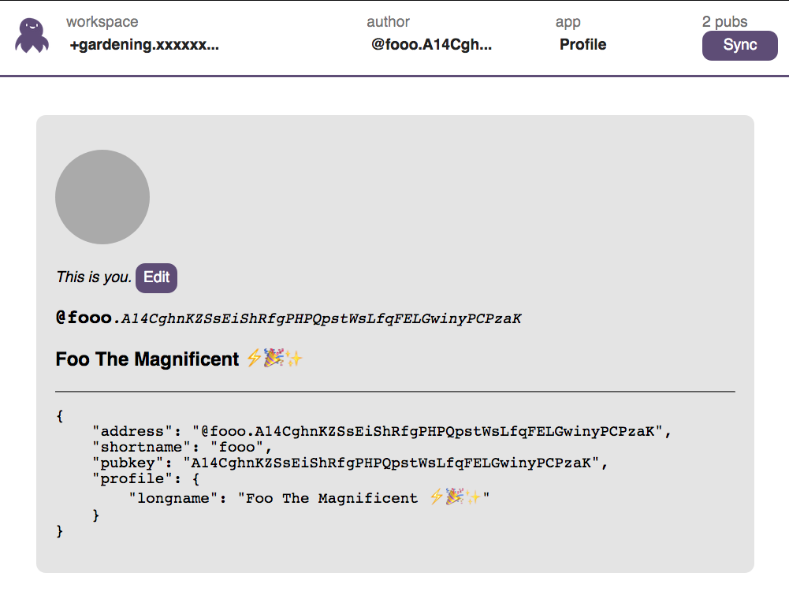

# Earthstar OS

Run a collection of apps in [Earthstar](https://github.com/cinnamon-bun/earthstar) workspaces, and easily switch apps on the same workspace data.  Or easily switch the data out from underneath the app.

Platform: browsers

Status: *alpha, in flux*



### Wait, what's Earthstar?

It's in the family of Dat and Secure Scuttlebutt.  It's a p2p shared folder that multiple people can edit, with rules enforced by cryptography.  It exists in many places that are synced with each other -- many people can redundantly keep it online, without having power over it.  You can use it offline, then sync later.

A **workspace** is like a shared folder holding **documents** which can be edited by **authors**.  Authors are identified by crypto keypairs.

To keep a workspace online, it needs one or more [**pub servers**](https://github.com/cinnamon-bun/earthstar-pub), and/or for some users to be on a p2p network like hyperswarm so they can talk directly to each other.

### Ok tell me about this screenshot

Across the top of the screen is the Earthbar, which lets you easily switch between multiple workspaces and user identities.  It also lets you change the App you're using.

An App is a React component that gives you a particular view into a workspace.  Apps could be things like:

* Profile (lets you view / edit your author profile.  Pictured above.)
* Wiki viewer / editor
* Todo lists
* Blogging / commenting
* General document browser
* Chess
* Collaborative pixel art?
* Interactive fiction maker?
* Etc

All these apps read from the same underlying documents in the workspace.  You could have three different Chess apps showing the same chess games.

### How to make an App

Real docs coming soon once things stabilize!

This is not limited to React, you can use any framework you like.  There's a Router class which stores the overall state (which workspace, which app, ...).  Your app subscribes to changes in that state.

Eventually I'd like to have each app be a separate standalone HTML file (with embedded JS).  Just drop all your apps into a folder on a webserver.

Eventually eventually, apps could be distributed via Earthstar itself.

Structure of this repo:
```
EarthstarRouter      // Instantiates workspaces, handles overall state
    - Earthbar       // UI to switch workspaces, authors, apps
    - AppSwitcher    // Chooses which App component to render
        - DebugApp   // Example app, shows all the info an App can know
        - ProfileApp // Example app, shows a user profile

workspace.ts    // A mega-class holding a bunch of modular Earthstar pieces
                // such as Storage, Syncer, etc, in a single object

emitter.ts   // An event emitter kind of thing.  The router uses these
             // to emit events for changes to the workspace, the app, etc
```
